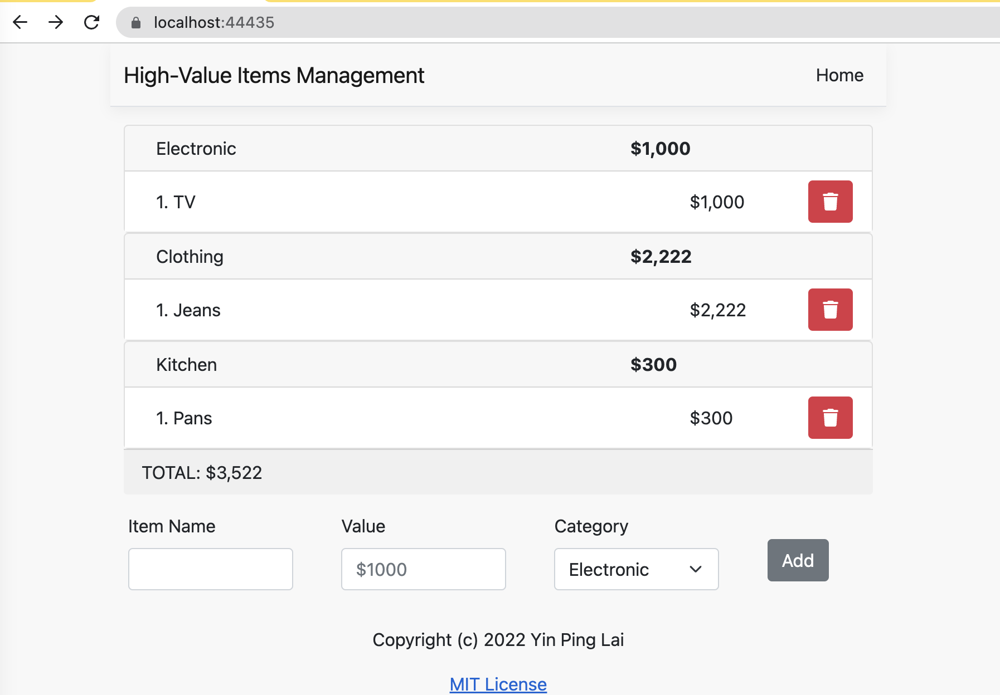

# High-Values item management application

An simple project for managing high-values items.

 

## Installation
- MongoDB latest community version
- Node.js 14+
- C# .Net Core 6.x+

## Quick Start
```bash
cd src/ClientApp
npm install
dotnet clean
dotnet build
dotnet run
```
Open Google Chrome browser and navigate to the [https://localhost:7292](https://localhost:7292)

## Running Unit Test Cases
```bash
cd src/ClientApp
npm test
```
 

## License

MIT
